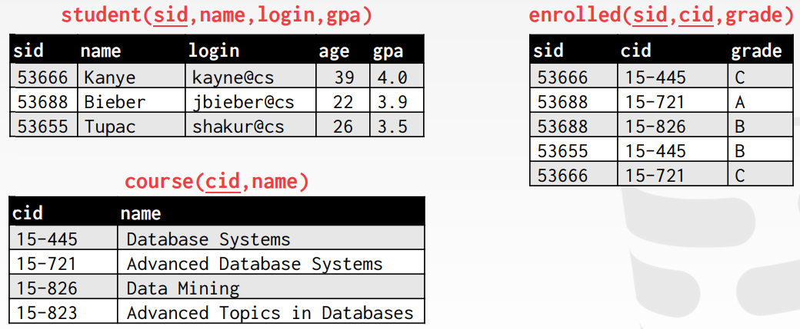
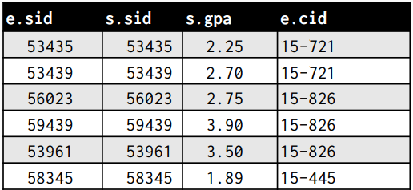
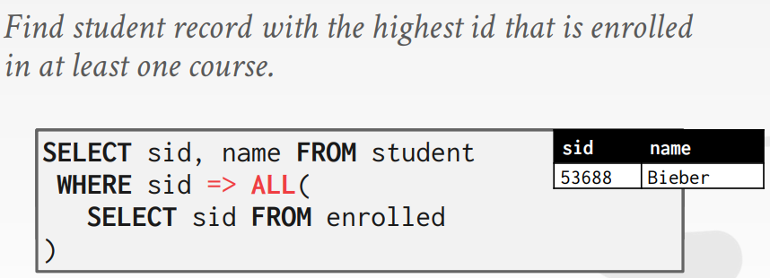

# Database system summary

##  Different design for data model

### Hierarchical structure

Records' relationships form a treelike model, which is simple but inflexible because the relationship is confined to a one-to-many relaitonship.

The main drawback of hierarchical structure is :

1. Information is repeated.
2. Existence depends on parents.
3. Record-at-a-time access DML

### Network structure

Networks are more flexible than hierarchies but more complex.

Loading and recovering networks is more complex than hierarchies

### Relational

设计理念:

1. Store the data in a simple data structure (Table)
2. Access it through a high level set-at-a-time DML
3. No need for a physical storage proposal

进一步产生了 -> Entity-relationship (ER) data model

Statements:

A data base be thought of a collection of instances of entities. In addition, entities have attributes, which are the data elements that characterize the entity. One or more of there atrributes would be designated to be unique (key). Lastly, there could be relationships between the entities. Relationships could be 1-to-1, 1-to-n, n-to-1 or m-to-n, depending on how the entities participate in the relationship.

## Concepts

A data model is collection of concepts for describing the data in a database

A schema is a description of a particular collection of data, using a given data model

## Data model

Relational

NoSQL:

​	Key/Value

​	Graph

​	Column-family

## Relational model

Primary key: Uniquely identifies a single tuple

Auto-generation of unique integer:

MySQL -> AUTO-INCREMENT

Foreign key: specifies that an attribute from one relation has to map to a tuple in another relation

## Relational algebra

Operators: 


Each operator takes one or more relations as inputs and outputs a new relation

### Select

Choose a subset of tuples from a relation that satisfies a selection predicate.

-> Predicate acts as a filter to retain only tuples that fullfill it qualifying requirement.

-> Can combine multiple predicates using conjunction / disjunction

### Projection

Generate a relation with tuples that contains only the specified attributes. 

-> Can rearrange attributes' ordering

-> Can manipulate the value

### Union 

Generate a relation that contains all tuples that appear in either only one or both input relation. 

Intersection similar

### Different

Generation a relation that contains only the tuples that appear in the first and not the second of the input relations

### Product (Cross Join)

Generate a relation that contains all possible combinations of tuples from the input relations.

### Join

Generate a relation that cantains all tuples that are a combination of two tuples, with a common values for one or more attributes.

### Extra operatiors

Rename, Assignment, Duplicate Elimination, Aggregation, Sorting, Division

## SQL

Relational algebra defines the high-level steps of how to compute a query


A better approach is to state the high-lelve answer that you want the DBMS to compute. SQL is the de facto standard

Including :
Data Manipulation Language (DML)

Data Definition Language (DDL)

Data Control Language (DCL)

View definition

Integrity & Referential constrains

Transaction

**Important**: SQL is based on bags(duplicates) not sets(no duplicates)

### Example Database



### Aggregates

Functions that return a single value from a bag of tuples

Aggregate functions can only be used in the SELECT output list

```SQL
SELECT COUNT(login) AS cnt FROM student WHERE login LIKE '%@cs'
```

COUNT, SUM, AVG support DISTINCT

Output of other columns outside of an aggregate is undefined

### Group By

Project tuples into subsets and calculate aggregates against each subset.





Non-aggregated values in SELECT output clause must appear in GROUP BY clause.


### Having

Filter results based on aggregation computation. Like a WHERE clause for a GROUP BY


上面这个SQL语句是错误的，因为SQL的执行顺序是

$FROM \rightarrow WHERE \rightarrow GROUP \ BY \rightarrow AGGREGATION \rightarrow HAVING$

所以当WHERE clause执行时，并不知道avg_gpa的值。这是就要用到having 语句， 当aggregation根据group by执行完后，使用Having进行filtering 操作。


### String operations

**Like** is used for string matching

'%' Matches any substring(including empty strings)

'_' Match any one character


'||' : concatenate two or more strings togather


### Output Redirection

Store query results in another table, table will have the same number of columns with the same types as the input


### Output control

```SQL
ORDERED BY <column*> [ASC|DESC]
```

Order the output tuples by the values in one or more of their columns

```sql
LIMIT <count> [OFFSET]
```

-> Limit the number of tuples returned in output

-> Can set an offset to return a "range"

### Nested queries

Queries containing other queries. They are often difficult to optimize.

Inner queries can appear (almost) angwhere in query

ALL -> Must satisfy expression for all rows in subquery

ANY-> Must satisfy expression for at least one row in sub-query

IN -> Equivalent to '=ANY()'

EXISTS -> At least one row is returned.




### Window functions

Performs a "sliding" calculation across a set of tuples that are related.


Aggregation functions:

Special window functions:
-> ROW_NUMBER() -> number of the current row

-> Rank() -> Order position of the current row


The **OVER** keyword specifies how to group together tuples when computing the window function.

Use **Partition by** to specify group.


You can also include an **ORDER BY** in the window grouping to sort entries in each group


Group tuples by cid then sort by grade

### COMMON TABLE EXPRESSIONS

Provides a way to write auxiliary statements for use in a larger query

-> Think of it like a temp table just for one query

Alternative to nested queries and views.


You can bind output columns to names before the AS keyword


