# Database system summary

##  Different design for data model

### Hierarchical structure

Records' relationships form a treelike model, which is simple but inflexible because the relationship is confined to a one-to-many relaitonship.

The main drawback of hierarchical structure is :

1. Information is repeated.
2. Existence depends on parents.
3. Record-at-a-time access DML

### Network structure

Networks are more flexible than hierarchies but more complex.

Loading and recovering networks is more complex than hierarchies

### Relational

设计理念:

1. Store the data in a simple data structure (Table)
2. Access it through a high level set-at-a-time DML
3. No need for a physical storage proposal

进一步产生了 -> Entity-relationship (ER) data model

Statements:

A data base be thought of a collection of instances of entities. In addition, entities have attributes, which are the data elements that characterize the entity. One or more of there atrributes would be designated to be unique (key). Lastly, there could be relationships between the entities. Relationships could be 1-to-1, 1-to-n, n-to-1 or m-to-n, depending on how the entities participate in the relationship.

## Concepts

A data model is collection of concepts for describing the data in a database

A schema is a description of a particular collection of data, using a given data model

## Data model

Relational

NoSQL:

​	Key/Value

​	Graph

​	Column-family

## Relational model

Primary key: Uniquely identifies a single tuple

Auto-generation of unique integer:

MySQL -> AUTO-INCREMENT

Foreign key: specifies that an attribute from one relation has to map to a tuple in another relation

## Relational algebra

Operators: 


Each operator takes one or more relations as inputs and outputs a new relation

### Select

Choose a subset of tuples from a relation that satisfies a selection predicate.

-> Predicate acts as a filter to retain only tuples that fullfill it qualifying requirement.

-> Can combine multiple predicates using conjunction / disjunction

### Projection

Generate a relation with tuples that contains only the specified attributes. 

-> Can rearrange attributes' ordering

-> Can manipulate the value

### Union 

Generate a relation that contains all tuples that appear in either only one or both input relation. 

Intersection similar

### Different

Generation a relation that contains only the tuples that appear in the first and not the second of the input relations

### Product (Cross Join)

Generate a relation that contains all possible combinations of tuples from the input relations.

### Join

Generate a relation that cantains all tuples that are a combination of two tuples, with a common values for one or more attributes.

### Extra operatiors

Rename, Assignment, Duplicate Elimination, Aggregation, Sorting, Division

## SQL

Relational algebra defines the high-level steps of how to compute a query


A better approach is to state the high-lelve answer that you want the DBMS to compute. SQL is the de facto standard

Including :
Data Manipulation Language (DML)

Data Definition Language (DDL)

Data Control Language (DCL)

View definition

Integrity & Referential constrains

Transaction

**Important**: SQL is based on bags(duplicates) not sets(no duplicates)

### Example Database


### Aggregates

Functions that return a single value from a bag of tuples

Aggregate functions can only be used in the SELECT output list

```SQL
SELECT COUNT(login) AS cnt FROM student WHERE login LIKE '%@cs'
```

COUNT, SUM, AVG support DISTINCT

Output of other columns outside of an aggregate is undefined

### Group By

Project tuples into subsets and calculate aggregates against each subset.


Non-aggregated values in SELECT output clause must appear in GROUP BY clause.


### Having

Filter results based on aggregation computation. Like a WHERE clause for a GROUP BY


上面这个SQL语句是错误的，因为SQL的执行顺序是

$FROM \rightarrow WHERE \rightarrow GROUP \ BY \rightarrow AGGREGATION \rightarrow HAVING$

所以当WHERE clause执行时，并不知道avg_gpa的值。这是就要用到having 语句， 当aggregation根据group by执行完后，使用Having进行filtering 操作。


### String operations

**Like** is used for string matching

'%' Matches any substring(including empty strings)

'_' Match any one character


'||' : concatenate two or more strings togather

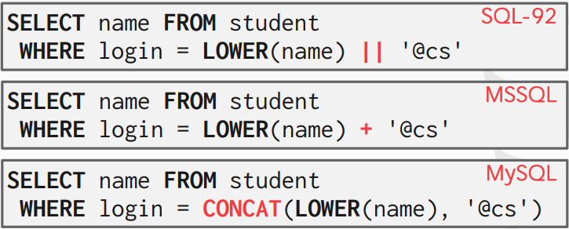

### Output Redirection

Store query results in another table, table will have the same number of columns with the same types as the input


### Output control

```SQL
ORDERED BY <column*> [ASC|DESC]
```

Order the output tuples by the values in one or more of their columns

```sql
LIMIT <count> [OFFSET]
```

-> Limit the number of tuples returned in output

-> Can set an offset to return a "range"

### Nested queries

Queries containing other queries. They are often difficult to optimize.

Inner queries can appear (almost) angwhere in query

ALL -> Must satisfy expression for all rows in subquery

ANY-> Must satisfy expression for at least one row in sub-query

IN -> Equivalent to '=ANY()'

EXISTS -> At least one row is returned.


### Window functions

Performs a "sliding" calculation across a set of tuples that are related.


Aggregation functions:

Special window functions:
-> ROW_NUMBER() -> number of the current row

-> Rank() -> Order position of the current row

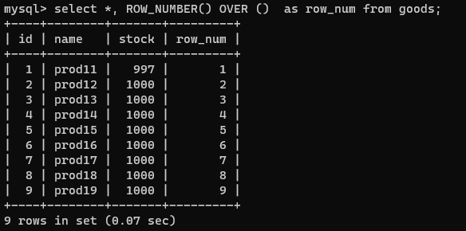

The **OVER** keyword specifies how to group together tuples when computing the window function.

Use **Partition by** to specify group.


You can also include an **ORDER BY** in the window grouping to sort entries in each group


Group tuples by cid then sort by grade

### COMMON TABLE EXPRESSIONS

Provides a way to write auxiliary statements for use in a larger query

-> Think of it like a temp table just for one query

Alternative to nested queries and views.


You can bind output columns to names before the AS keyword


## Storage

### Access Time

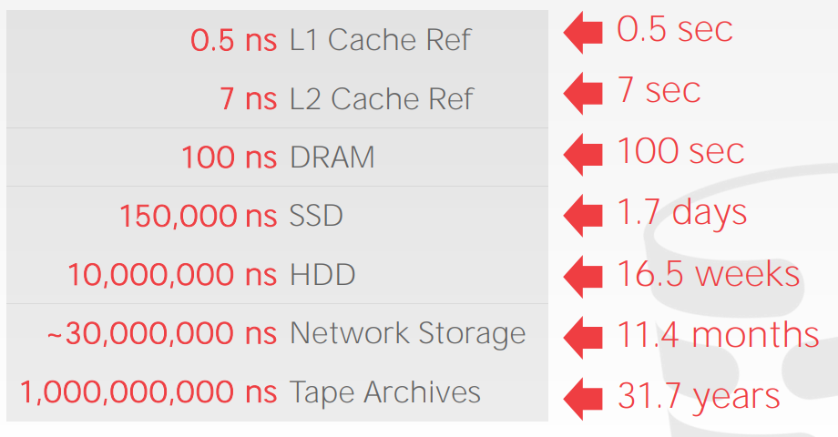

### 为什么不借助操作系统

One can use memory mapping(mmap) to store the contents of a file into a process' address space.

The OS is responsible for moving data for moving the files' pages in and out of memory.

DBMS (almost) always want to control things itself and can do a better job at it.

-> Flushing dirty pages to disk in the correct order

-> Specialized prefetching

-> Buffer replacement policy

-> Thread/process scheduling

### File storage

The DBMS stores a database as one or more files on disk. The os doesn't know anything about the contents of these files.

#### Storage manager

The storage manager is responsible for maintaining a database's files. Some do their own scheduling for reads and writes to improve spatial and temporal locality of pages.

It organizes the files as a collection of *pages*.

-> Track data read/written to pages.

-> Track the available space

A page is a fixed-size block of data.

-> It can contain tuples, meta-data, indexes, log records..

-> Most systems do not mix page types

-> Some systems require a page to be self-contained.

Each page is given a unique identifier.

-> The DBMS uses an indirection layer to map page ids to physical locations.

Different DBMSs manage pages in files on disk in different ways

-> Heap file organization

-> Sequential/ Sorted File Organization

-> Hashing File Organization

#### DATABASE HEAP

A heap file is an unordered collection of pages .

Need meta-data to keep track of what pages exist and which ones have free space.

Two ways to represent a heap file:

-> LinkedList

-> Page directory

#### Linked list

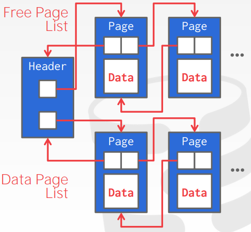

Maintain a header page at the begining of the file that stores two pointers:

-> HEAD of the free page list

-> HEAD of the data page list

Each page keeps track of the number of free slots in itselt

#### Page directory

The DBMS maintains special pages that tracks the location of data pages in the database files.

The directory also records the number of free slots per page

The DBMS has to make sure that the directory pages are in sync with data pages.

#### Page Header

Every page contains a header of meta-data about the page's contents.

-> Page size

-> Checksum

-> DBMS Version

-> Transaction Visibility

-> Compression information

### Page Layout

So how to organize the data stored inside of the page?

Two approaches:

1. Tuple-oriented
2. Log-structured

#### Slotted Pages

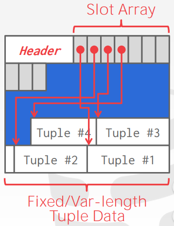

The Slot Array maps "slots" to the tuples' starting position offsets.

The header keeps track of:

1. The number of used slots
2. The offset of the starting location of the last slot used.

#### Log-structed file organization

Instead of storing tuples in pages, the DBMS only sotres log records.

The system appends log records to the file of how the database was modified.

-> Inserts store the entire tuple

-> Deletes mark the tuple as deleted

-> Updates contain the delta of just the attributes that were modified.

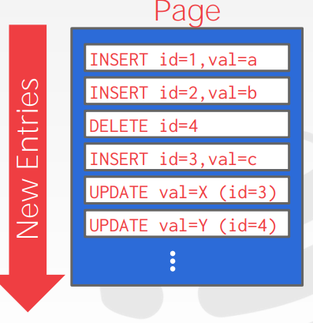

To read a record, The DBMS scans the log backwards and "recreates" the tuple to find what it needs.

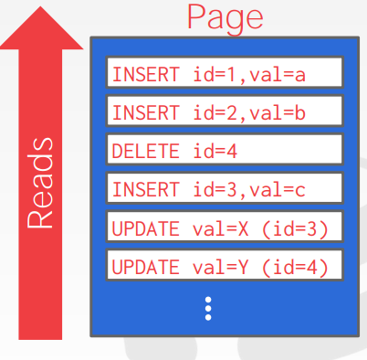

Build indexes to allow it to jump to locations in the log


Periodically compact the log

### Tuple Layout

A tuple is essentially a sequence of bytes. It is the job of DBMS to interpret those bytes into attributes types and values.

#### Tuple header

Each tuple is prefixed with a header that contains meta-data about it.

-> Visibility info(Concurrency control)

-> Bit Map for NULL values

#### Record IDs

The DBMS needs a way to keep track of individual tuples. Each tuple is assigned a unique record identifier.

-> Most common: page_id + offset/slot

-> Can also contain file location info

### System catalog

A DBMS stores meta-data about databases in its internal catalogs

-> Tables, Columns, indexes, views

-> Users, Permissions

-> Internal statistics

Accessing table schema: 

```MYSQL
DESCRIBE student; 
```


### OLTP: On-line transaction processing

Simple queries that read/update a small amount of data that is related to a single entity in the database.

### OLAP: On-Line Analytical Processing

Complex queries that read large portions of the database spanning multiple entities.

## Buffer pool

How the DBMS manages its memory and move data back-and-forth from disk

Spatial Control:
-> Where to write pages on disk;

-> **The goal is to keep pages that are used together often as physically close together as possible on disk.**

Temporal Control:

-> When to read pages into memory, and when to write them to disk.

-> **The goal is minimize the number of stalls from having to read data from disk.**

### Buffer pool organization

Memory region organized as an array of fixed-size pages.

An array entry is called a frame

When the DBMS requests a page, an exact copy is placed into one of these frames.

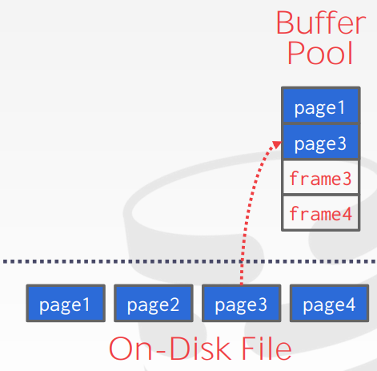

The **page table** keeps track of pages that are currently in memory

Also maintains additional meta-data per page:

-> **Dirty Flag**

-> **Pin/Reference Counter**

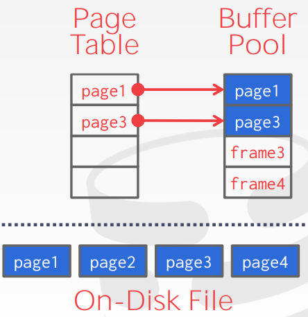

If page3 is fetched by the DBMS, then this page thould be pinned, so it can not be replaced by replacement policy.

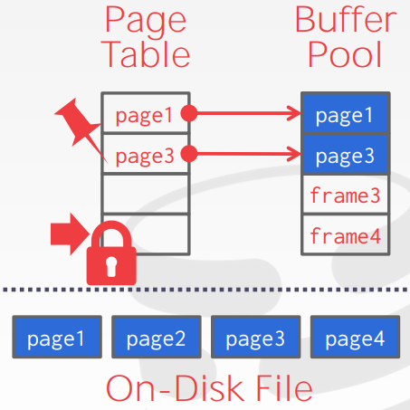

### Lock verse Latches

Locks:

1. Protects the database's logical contents from other transactions
2. Held for transaction duration
3. Need to be able to rollback changes

Latches:

1. Protects the critical sections of DBMS's internal data structure from other threads.
2. Held for operation duration.
3. Do not need to be able to rollback changes.

### Page table verse Page directory

The page directory is the mapping from the page ids to page location in the database files.

-> All changes must be recorded on disk to allow the DBMS to find on restart.

The page table is the mapping from the page ids to to a copy of the page in buffer pool frames.

-> This is an in-memory data structure that does not need to be store on disk

### Buffer pool optimizations

#### Multiple buffer pools

The DBMS does not always have a single buffer pool for the entire system.

-> Multiple buffer pool instances.

-> Per-database buffer pool

-> Per-page type buffer pool

Helps reduce latch contention and improve locality

#### Pre-fetching

The DBMS can also prefetch pages based on a query plan.

-> Sequential scans

-> Index scans

```mysql
SELECT * FROM A WHERE val BETWEEN 100 AND 250
```

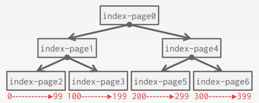


So we can prefetch the index-page5 in the same time we fetch the page index-page3.

#### Scan sharing

Queries can reuse data retrieved from storage or operator computations.

Allow multiple queries to attach to a single cursor that scans a tables.

-> Queries do not have to be the same 

-> Can also share intermediate results

If a query starts a scan and if there one already doing this, then the DBMS will attach to the second query's cursor.

-> The DBMS keep track of where the second query joined with the first so that it can finish the scan when it reaches the end of the data structure.

### Buffer pool bypass

The sequential scan operator will not store fetched pages in the buffer pool to avoid overhead.

-> Memory is local to running query.

-> Works well if operator needs to read a large sequence of pages that are contiguous on disk.

### OS page cache

Most disk operations go through the OS API.

Unless you tell it not to, the OS maintains its own filesystem cache.

Most DBMSs use direct I/O (O_DIRECT) to bypass the OS cache.

-> Redundant copies of pages.

-> Different eviction policies.

### Buffer replacement policies

When the DBMS needs to free up a frame to make room for a new page, it must decide which page to evict from the buffer pool.

-> LRU

-> Clock: Approximation of LRU without needing a separate timestamp per page.

​	-> Each page has a reference bit

​	-> When a page is accessed, set to 1

Organize the pages in a circular buffer with a "clock hand"

-> Upon sweeping, check if a page's bit is set to 1

-> If yes, set to 0, if no, then evict

LRU and CLOCK replacement policies are susceptible to sequential flooding. → A query performs a sequential scan that reads every page. → This pollutes the buffer pool with pages that are read once and then never again.

The most recently used page is actually the most unneeded page.

#### BETTER POLICIES: LRU-K

Track the history of the last K references as timestamps and compute the interval between subsequent accesses.

The DBMS then uses this history to estimate the next time that page is going to be accessed.

#### BETTER POLICIES: LOCALIZATION

The DBMS chooses which pages to evict on a per txn/query basis. This minimizes the pollution of the buffer pool from each query. 

→ Keep track of the pages that a query has accessed.

### Dirty pages

Fast: If a page in the buffer pool is not dirty, the DBMS can simple "drop" it.

SLOW: if a page is dirty, then the DBMS must write back to disk to ensure that its changes are persisted.

Trade-off between fast evictions versus dirty writing pages that will not be read again in the future.

The DBMS can periodically walk through the page table and write dirty pages to disk. 

When a dirty page is safely written, the DBMS can either evict the page or just unset the dirty flag. 

Need to be careful that we don’t write dirty pages before their log records have been written…

### Other memory pools

The DBMS needs memory for things other than just tuples and indexes. 

These other memory pools may not always backed by disk. Depends on implementation.

-> Sorting + Join buffers

-> Query Caches

-> Maintenance Buffers

-> Log Buffers

-> Dictionary Caches
